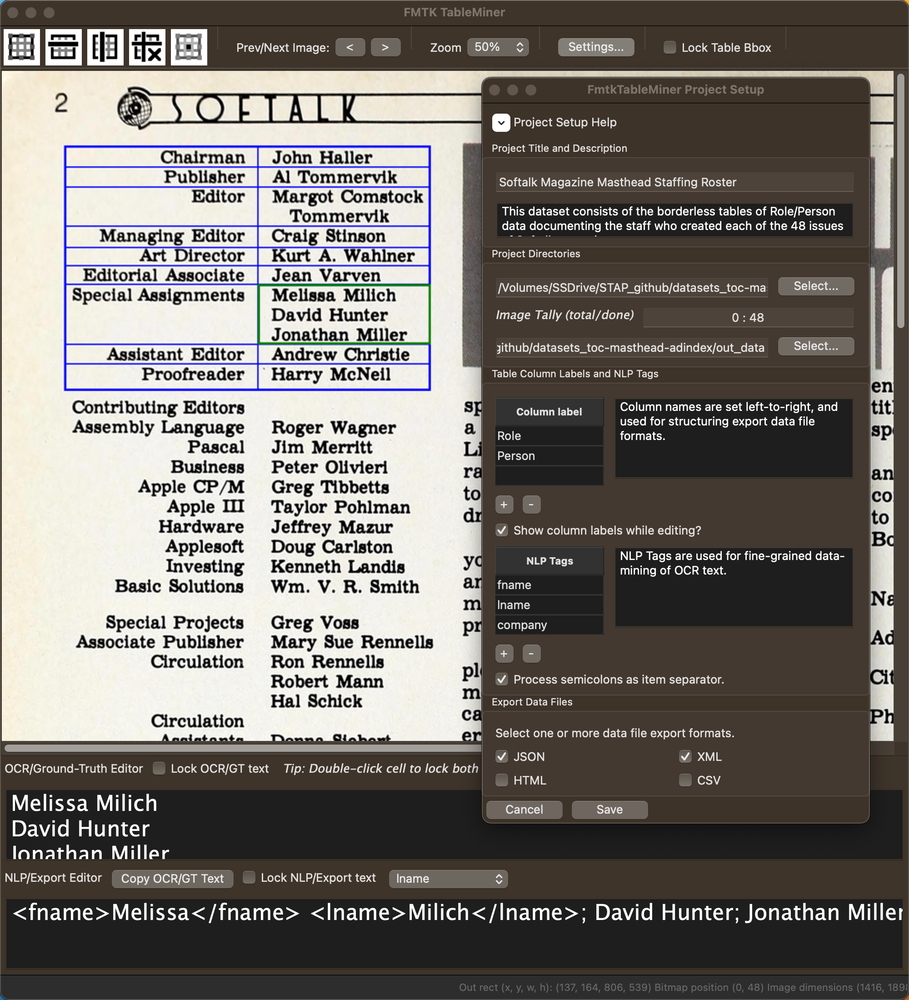
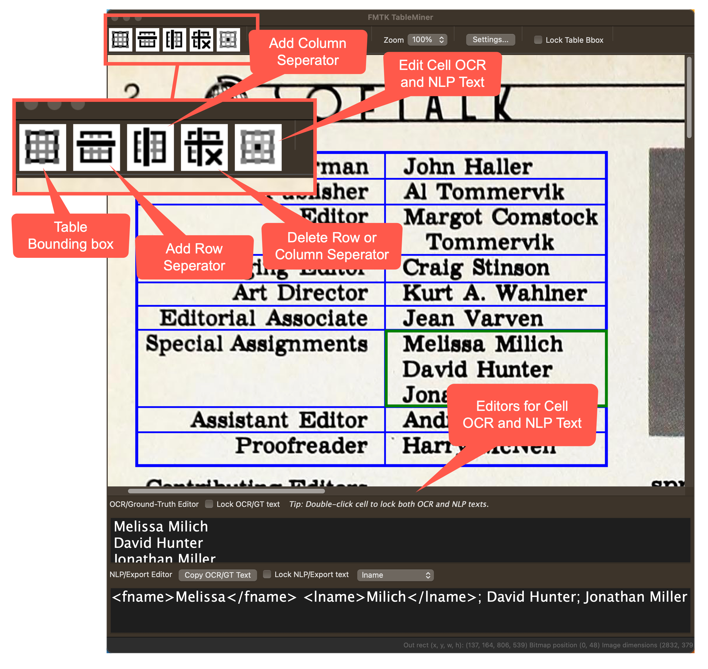

# The FactMinersToolKit - TableMiner
 __FmtkTableMiner__ is a tool focused on text- and data-mining table structures in text documents as part of the __FactMiners Toolkit__ (fmtk) Digital Humanities project.

 
The overall __FactMiners Toolkit__ is a growing collection of Python-based apps and libraries supporting development of the __MAGAZINEgts Ground Truth Storage__ format. This project is focused on development of a _standards-based_ storage format for an _integrated model_ for __complex document structures__ and __content depiction__ in _print-era commercial magazines_, especially the vast trove of these serial publications in the __Internet Archive__.

## TableMiner Overview
 
__TableMiner__ is designed for the creation of _Ground Truth datasets_ of document samples to be used for training of Machine Learning models. It is _not_ focused on high volume automated or semi-automated recognition of borderless (or bordered) table data. Examples of the typical use cases for TableMiner in the context of the MAGAZINEgts project are the text- and data-mining of masthead person/role staffing lists, in-article and recurring column lists such as best sellers, advertisement indexes, and product/price lists in advertisements.

 
The emphasis for TableMiner design is efficient identification and specification of the table structure's row-and-column bounding box cells, together with cell-specific accurate curation of OCRed text including optional text annotation for NLP or similar semantic refinement.
 
Once the cell-wise structure of the target table has been identified, TableMiner uses __Tesseract__ for individual cell OCR text extraction. The TableMiner UI/UX then provides a convenient view on the cell's text for correction to Ground Truth level accuracy. Users may optionally apply NLP or similar post-extraction tagging to further refine the semantics of the Ground Truth data.
 
Once a table structure has been curated, the table's text and data may be saved to output files in __JSON__, __XML__, __HTML__, and/or __CSV__ formats.

## Installation
The current state of this project requires that prospective users be able to download and install the codebase to a local Python-supporting local machine. Before running this app/tool, activate the virtual envirnment, such as a conda env, and install the reprequisite modules beyond the standard libraries supplied by your base Python environment by processing this project's `requirements.txt` file. To do this, launch your commanline terminal application and change to the project directory where you have installed the FmtkTableMiner codebase. Then run this statement:

`pip install -r requirements.txt`

Once this codebase is downloaded and its required support libraies installed, the __TableMiner__ app/tool may be run from a commanline prompt by changing to the source installation directory (the `\src` subdirectory within this project's repository) and executing this statement:

  `python fmtk_tableminer_app.py`

__Note__: MacOS users will need to call this script with the framework-enabling `pythonw` call to support the tool's desktop user interface generation.

We hope to provide standalone easy-installation releases of this tool once the codebase is stable and feature-complete.

## Tips for Recommended Workflow
The recommended workflow for a TableMiner dataset-development project is to collect the page images of a serially published table structure in an input directory. Once the user sets the project specification for the input and output directories, the user can begin walking sequentially through the input page images. 

Page changes automatically save the output data files. A project-specific YAML-based configuration file is supported to allow convenient multi-session processing of the project's input data. In addition to generating the variously formatted output data files, a page image is generated with the bounding box grid-based border structure of the target table. These output table images may optionally include the column header labels to support _ML-based object recognition and classification_.

__Best Practice Tip__: While we do our best to support step-wise table structure specification of table rows, such structure-refining edits of the table grid are far more logically disruptive for column structure changes. Given this situation, it is best if the user completes the grid-specification row/column border identification __before__ beginning cell-wise Ground Truth OCR and optional NLP cell-wise text extraction and semantic refinement.

## Feedback and Bug Reporting
Prospective users are encouraged to use the wiki and issues features of the FmtkTableMiner GitHub repository to resolve issues or provide feedback and feature requests. Code contributions welcome.

## Release Note
This initial drop of the __FmtkTableMiner__ tool is essentially a _Preview_ release to demonstrate the UI/UX of the upcoming functional release. _At present, only the project-level configuration settings are persistently saved to disk._ Individual page table structures and GTS/NLP text extraction data are __NOT saved to disk__! This all important feature is in development and will be released soon.

Happy, Healthy Vibes from Colorado,
-: __Jim Salmons__ :-
obo the __FactMiners__ Digital Humanities project